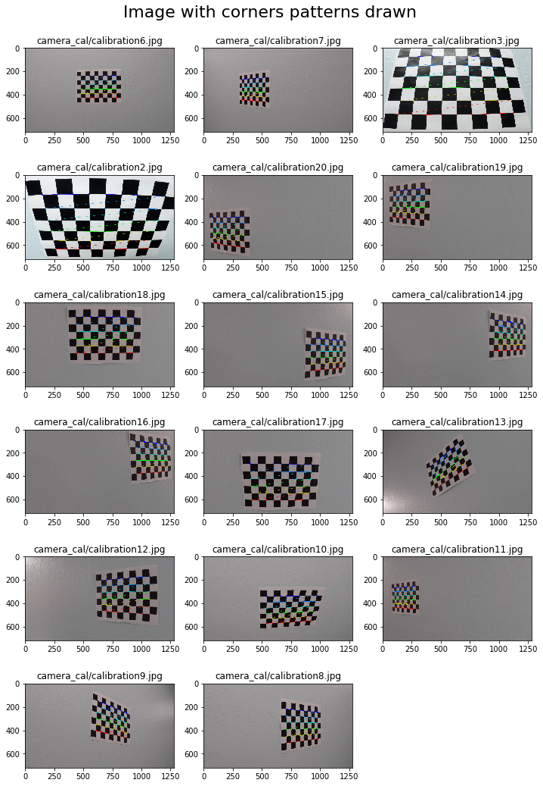
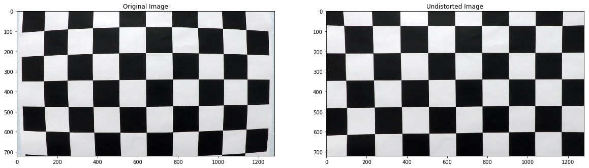
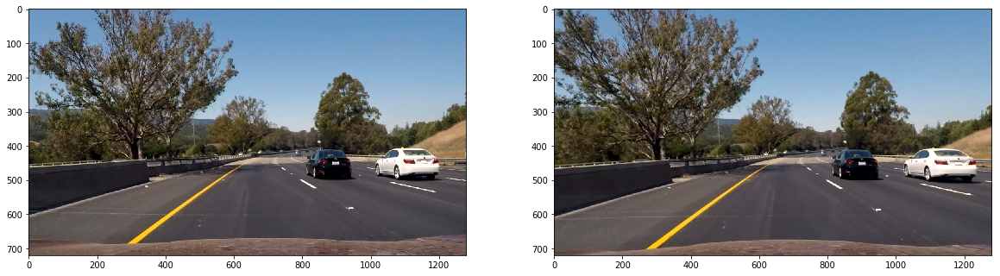
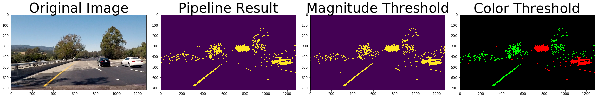
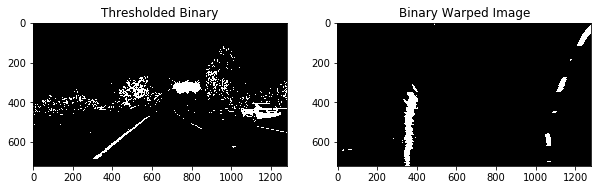
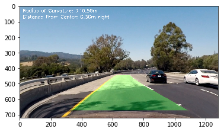

# Advance Lane Detection

**Advanced Lane Finding Project**

The goals / steps of this project are the following:

* Compute the camera calibration matrix and distortion coefficients given a set of chessboard images.
* Apply a distortion correction to raw images.
* Use color transforms, gradients, etc., to create a thresholded binary image.
* Apply a perspective transform to rectify binary image ("birds-eye view").
* Detect lane pixels and fit to find the lane boundary.
* Determine the curvature of the lane and vehicle position with respect to center.
* Warp the detected lane boundaries back onto the original image.
* Output visual display of the lane boundaries and numerical estimation of lane curvature and vehicle position.

# Camera Calibration 

* Camera has been calibrated using chessboard images found on the camera_cal folder. 
* [Reference](https://github.com/udacity/CarND-Camera-Calibration)

- The number of corners in x axis and y axis are defined so opencv can find the corners in the image and store the object points in objpoints and imgpoints array, 
- which will later be used to get the camera matrix from calibrate camera function.
- camera matrix is useful in undistorting the image


```python
import cv2
import glob
import numpy as np
import matplotlib.pyplot as plt
import matplotlib.image as mpimg
%matplotlib inline

x_cor = 9 
y_cor = 6
# Prepare object points, like (0,0,0), (1,0,0), (2,0,0) ....,(6,5,0)
objp = np.zeros((y_cor*x_cor,3), np.float32)
objp[:,:2] = np.mgrid[0:x_cor, 0:y_cor].T.reshape(-1,2)

# Arrays to store object points and image points from all the images.
objpoints = [] # 3d points in real world space
imgpoints = [] # 2d points in image plane.
images = glob.glob('camera_cal/calibration*.jpg') # Make a list of paths to calibration images
# Step through the list and search for chessboard corners

plt.figure(figsize=(12, 18)) #Figure for calibration images
plt.figtext(0.5,0.9,'Image with corners patterns drawn', fontsize=22, ha='center')
for idx, fname in enumerate(images):
    img = cv2.imread(fname)
    gray = cv2.cvtColor(img, cv2.COLOR_BGR2GRAY) # Conver to grayscale
    ret, corners = cv2.findChessboardCorners(gray, (x_cor,y_cor), None) # Find the chessboard corners
    # If found, add object points, image points
    if ret == True:
        objpoints.append(objp)
        imgpoints.append(corners)
        plt.subplot(len(images)//3,3, len(imgpoints))
        cv2.drawChessboardCorners(img, (x_cor,y_cor), corners, ret)
        plt.imshow(img)
        plt.title(fname)
        #plt.axis('off')
plt.show()

```





```python

img = cv2.imread('camera_cal/calibration1.jpg')
img_size = (img.shape[1], img.shape[0])

# Do camera calibration given object points and image points
ret, mtx, dist, rvecs, tvecs = cv2.calibrateCamera(objpoints, imgpoints, img_size,None,None)

dst = cv2.undistort(img, mtx, dist, None, mtx)
cv2.imwrite('calibration_wide/test_undist.jpg',dst)

# Visualize undistortion
f, (ax1, ax2) = plt.subplots(1, 2, figsize=(20,10))
ax1.imshow(img)
ax1.set_title('Original Image')
ax2.imshow(dst)
ax2.set_title('Undistorted Image')
```


    Text(0.5,1,'Undistorted Image')





# Camera Class
- Defining a camera class will help in future projects
- This camera class has chessboard_calibrate function which was explained earlier.
- This helps in initializing one class to access all camera properties


```python
class camera:
    def __init__(self):
        self.objpoints = None
        self.imgpoints = None
        self.mtx = None
        self.dist = None
        
    def chessboard_calibrate(self,img_path,x_cor,y_cor):
        # Prepare object points, like (0,0,0), (1,0,0), (2,0,0) ....,(6,5,0)
        objp = np.zeros((y_cor*x_cor,3), np.float32)
        objp[:,:2] = np.mgrid[0:x_cor, 0:y_cor].T.reshape(-1,2)

        # Arrays to store object points and image points from all the images.
        self.objpoints = [] # 3d points in real world space
        self.imgpoints = [] # 2d points in image plane.
        img_size = None
        images = glob.glob(img_path) # Make a list of paths to calibration images
        # Step through the list and search for chessboard corners
        for idx, fname in enumerate(images):
            img = cv2.imread(fname)
            gray = cv2.cvtColor(img, cv2.COLOR_BGR2GRAY) # Conver to grayscale
            ret, corners = cv2.findChessboardCorners(gray, (x_cor,y_cor), None) # Find the chessboard corners
            img_size = (img.shape[1], img.shape[0])
            # If found, add object points, image points
            if ret == True:
                self.objpoints.append(objp)
                self.imgpoints.append(corners)
        ret, self.mtx, self.dist, rvecs, tvecs = cv2.calibrateCamera(self.objpoints, self.imgpoints, img_size,None,None)
        
        
    def undistort(self,img):
        dst = cv2.undistort(img, self.mtx, self.dist, None, self.mtx)
        return dst
    
    
        
```


```python
cam = camera()
cam.chessboard_calibrate("camera_cal/calibration*.jpg",9,6)
img = plt.imread("test_images/test6.jpg")
f, (ax1, ax2) = plt.subplots(1, 2, figsize=(20,10))
ax1.imshow(img)
ax2.imshow(cam.undistort(img))
```


    <matplotlib.image.AxesImage at 0x11d586518>





# Color Filtering
* The color information can easily be inferred in HLS color space compared to RGB
* The saturation channel has been used in gradient threshold and magnitude threshold
* Tried to filter just the white and yellow colors in the pipeline
* Turns out for the project_video white and yellow filter turns out to be working well.
* The thresholding functions just give out the binary image with ones and zeros.


```python
import os

#from the course materials
def gradient_direction_thresh(img,kernel_size = 15, gradient_thresh = (170, 255)):
    img = np.copy(img)
    # Convert to HLS color space and separate the V channel
    hls = cv2.cvtColor(img, cv2.COLOR_RGB2HLS).astype(np.float)
    l_channel = hls[:,:,1]
    s_channel = hls[:,:,2]
    # Sobel
    sobelx = cv2.Sobel(s_channel, cv2.CV_64F, 1, 0, ksize=kernel_size)
    sobely = cv2.Sobel(s_channel, cv2.CV_64F, 0, 1, ksize=kernel_size)
    gradient_direction = np.arctan2(np.absolute(sobely), np.absolute(sobelx))
    binary_output =  np.zeros_like(gradient_direction)
    binary_output[(gradient_direction >= gradient_thresh[0]) & (gradient_direction <= gradient_thresh[1])] = 1
    return binary_output


def gradient_magnitude_thresh(img, kernel_size = 9, gradient_thresh=(30, 255)):
    img = np.copy(img)
    img = cv2.cvtColor(img, cv2.COLOR_RGB2HLS)
    s_channel = img[:,:,2]
    #sobel filter
    sobelx = cv2.Sobel(s_channel, cv2.CV_64F, 1, 0, ksize=kernel_size)
    sobely = cv2.Sobel(s_channel, cv2.CV_64F, 0, 1, ksize=kernel_size)
    gradmag = np.sqrt(sobelx**2 + sobely**2)
    scale_factor = np.max(gradmag)/255 
    gradmag = (gradmag/scale_factor).astype(np.uint8) 
    binary_output = np.zeros_like(gradmag)
    binary_output[(gradmag >= gradient_thresh[0]) & (gradmag <= gradient_thresh[1])] = 1
    return binary_output

def pipeline(img,color=False, mag_dir_thresh=False):
    rgbimg = np.copy(img)
    hls = cv2.cvtColor(rgbimg, cv2.COLOR_RGB2HLS).astype(np.float)

    lower_white = np.array([0,210,0], dtype=np.uint8)
    upper_white = np.array([255,255,255], dtype=np.uint8)
    white_mask = cv2.inRange(hls, lower_white, upper_white)
    
    ## Yellow Color
    lower_yellow = np.array([18,0,100], dtype=np.uint8)
    upper_yellow = np.array([30,220,255], dtype=np.uint8)
    yellow_mask = cv2.inRange(hls, lower_yellow, upper_yellow)  
    
    combined_binary = np.zeros_like(white_mask)
    
    # Dir Mag Threshold
    if mag_dir_thresh:
        dir_mask = gradient_direction_thresh(rgbimg)
        mag_mask = gradient_magnitude_thresh(rgbimg)
        combined_binary[((dir_mask == 1) & (mag_mask == 1))] = 255
        
    if color:
        return np.dstack((white_mask, yellow_mask, combined_binary))
    
    else:
        combined_binary[((white_mask == 255) | (yellow_mask == 255))] = 255
        combined_binary[(combined_binary == 255)] = 1
        return combined_binary


image = plt.imread(os.path.join('test_images', 'test4.jpg'))

result = pipeline(image)

# Plot the result
f, (ax1, ax2,ax3,ax4) = plt.subplots(1,4, figsize=(24, 9))
f.tight_layout()

ax1.imshow(image)
ax1.set_title('Original Image', fontsize=40)
ax2.imshow(result)
ax2.set_title('Pipeline Result', fontsize=40)
ax3.imshow(pipeline(image,False,True))
ax3.set_title("Magnitude Threshold",fontsize=40)
ax4.imshow(pipeline(image,True,False))
ax4.set_title("Color Threshold",fontsize=40)
plt.subplots_adjust(left=0., right=1, top=0.9, bottom=0.)
```





# Warping
The code for my perspective transform includes a function called `warp()` in LaneDetector class, which appears in `lane_detector.py` ( In LaneDetector Section of  IPython notebook).  The `warp()` function takes as inputs an image (`img`),The perspective was calculated and during the init process and it stores the source (`src`) and destination (`dst`) points in the class. I chose the hardcode the source and destination points in the following manner:


```python

img_size = (result.shape[1], result.shape[0])
width, height = img_size
offset = 200
src = np.float32([
    [  588,   446 ],
    [  691,   446 ],
    [ 1126,   673 ],
    [  153 ,   673 ]])
dst = np.float32([[offset, 0], [img_size[0] - offset, 0], [img_size[0] - offset, img_size[1]], [offset, img_size[1]]])
M = cv2.getPerspectiveTransform(src,dst)
Minv = cv2.getPerspectiveTransform(dst, src)

plt.figure(figsize=(10,40))
plt.subplot(1,2,1)
b_thresholded = pipeline(image)
plt.imshow(b_thresholded, cmap='gray')
plt.title('Thresholded Binary')

plt.subplot(1,2,2)
binary_warped = cv2.warpPerspective(b_thresholded,M, (width, height))
plt.imshow(binary_warped, cmap='gray')
plt.title('Binary Warped Image')
```


    Text(0.5,1,'Binary Warped Image')





This resulted in the following source and destination points:

| Source        | Destination   | 
|:-------------:|:-------------:| 
| 585, 460      | 320, 0        | 
| 203, 720      | 320, 720      |
| 1127, 720     | 960, 720      |
| 695, 460      | 960, 0        |

I verified that my perspective transform was working as expected by drawing the `src` and `dst` points onto a test image and its warped counterpart to verify that the lines appear parallel in the warped image.

# Find Curvature and Draw Curvature

## Find Curvature
- Adding up the pixel values along each column in the image. 
- In the binary image pixels are either 0 or 1, so the two most prominent peaks in this histogram will be good indicators of the x-position of the base of the lane lines. 
- The starting peak has been used as a starting point for where to search for the lines with margin of 100px and considering 1/9th of the image starting from bottom.
- This was then formed as points across the rows
- Array of these points has been later used in numpy polyfit function to give a second order equation(To form a curve)
- It was done on both the peaks
- The code for this is incorporated in the Lane detector class below on the function `find_curvature`
- Curvature Caluclation has been formulated according to this [Reference](https://www.intmath.com/applications-differentiation/8-radius-curvature.php)

## Drawing Curved Lane
- The curve equation from the previous step has been stored in the class and the histogram points.
- Now the area between the left and right equation were plotted green and used the inverse warp perspective transform to plot it back in the actual image
- This implementation can be found in LaneDetector Class `draw_curves` function. 

* The sequence needed for the undistortion, warping, curvature_detection and drawing the curves are sequenced in `find_curvature_sequence` function.


```python
import numpy as np
import cv2
import matplotlib.pyplot as plt

class LaneDetector:
    def __init__(self,img,camera_calibration_img_path = "camera_cal/calibration*.jpg"):
        self.img_size = (img.shape[1], img.shape[0])
        self.width, self.height = self.img_size
        offset = 200
        src = np.float32([
            [  588,   446 ],
            [  691,   446 ],
            [ 1126,   673 ],
            [  153 ,   673 ]])
        dst = np.float32([[offset, 0], [self.img_size[0] - offset, 0], [self.img_size[0] - offset, self.img_size[1]], [offset, self.img_size[1]]])
        self.M = cv2.getPerspectiveTransform(src,dst)
        self.Minv = cv2.getPerspectiveTransform(dst, src)
        
        self.left_fit = None
        self.right_fit = None
        self.cam = None
        self.cam_calibrate(camera_calibration_img_path)
        self.ym_per_pix = 3.0/72.0 # meters per pixel in y dimension
        self.xm_per_pix = 3.7/660.0 # meters per pixel in x dimension
        self.y_eval = 700
        self.midx = 640

    def cam_calibrate(self,img_path):
        self.cam = camera()
        self.cam.chessboard_calibrate(img_path,8,6)
    
    def undistort(self,img):
        return self.cam.undistort(img)
    
    def warp(self,binary_img):
        binary_warped = cv2.warpPerspective(binary_img,self.M, (self.width, self.height))
        return binary_warped
    
    
        
    def white_yellow_mask(self,img):
        rgbimg = np.copy(img)
        hls = cv2.cvtColor(rgbimg, cv2.COLOR_RGB2HLS).astype(np.float)
        ##white color
        lower_white = np.array([0,210,0], dtype=np.uint8)
        upper_white = np.array([255,255,255], dtype=np.uint8)
        white_mask = cv2.inRange(hls, lower_white, upper_white)
        ## Yellow Color
        lower_yellow = np.array([18,0,100], dtype=np.uint8)
        upper_yellow = np.array([30,220,255], dtype=np.uint8)
        yellow_mask = cv2.inRange(hls, lower_yellow, upper_yellow)  
        combined_binary = np.zeros_like(white_mask)
        combined_binary[((white_mask == 255) | (yellow_mask == 255))] = 255
        combined_binary[(combined_binary == 255)] = 1
        return combined_binary
    
    def find_curvature(self,binary_warped):
        # Assuming you have created a warped binary image called "binary_warped"
        # Take a histogram of the bottom half of the image
        #print(binary_warped.shape[0]/2)
        histogram = np.sum(binary_warped[binary_warped.shape[0]//2:,:], axis=0)
        # Create an output image to draw on and  visualize the result
        out_img = np.dstack((binary_warped, binary_warped, binary_warped))*255
        # Find the peak of the left and right halves of the histogram
        # These will be the starting point for the left and right lines
        midpoint = np.int(histogram.shape[0]/2)
        leftx_base = np.argmax(histogram[:midpoint])
        rightx_base = np.argmax(histogram[midpoint:]) + midpoint

        # Choose the number of sliding windows
        nwindows = 9
        # Set height of windows
        window_height = np.int(binary_warped.shape[0]/nwindows)
        # Identify the x and y positions of all nonzero pixels in the image
        nonzero = binary_warped.nonzero()
        nonzeroy = np.array(nonzero[0])
        nonzerox = np.array(nonzero[1])
        # Current positions to be updated for each window
        leftx_current = leftx_base
        rightx_current = rightx_base
        # Set the width of the windows +/- margin
        margin = 100
        # Set minimum number of pixels found to recenter window
        minpix = 50
        # Create empty lists to receive left and right lane pixel indices
        left_lane_inds = []
        right_lane_inds = []

        # Step through the windows one by one
        for window in range(nwindows):
            # Identify window boundaries in x and y (and right and left)
            win_y_low = binary_warped.shape[0] - (window+1)*window_height
            win_y_high = binary_warped.shape[0] - window*window_height
            win_xleft_low = leftx_current - margin
            win_xleft_high = leftx_current + margin
            win_xright_low = rightx_current - margin
            win_xright_high = rightx_current + margin
            # Draw the windows on the visualization image
            cv2.rectangle(out_img,(win_xleft_low,win_y_low),(win_xleft_high,win_y_high),
            (0,255,0), 2) 
            cv2.rectangle(out_img,(win_xright_low,win_y_low),(win_xright_high,win_y_high),
            (0,255,0), 2) 
            # Identify the nonzero pixels in x and y within the window
            good_left_inds = ((nonzeroy >= win_y_low) & (nonzeroy < win_y_high) & 
            (nonzerox >= win_xleft_low) &  (nonzerox < win_xleft_high)).nonzero()[0]
            good_right_inds = ((nonzeroy >= win_y_low) & (nonzeroy < win_y_high) & 
            (nonzerox >= win_xright_low) &  (nonzerox < win_xright_high)).nonzero()[0]
            # Append these indices to the lists
            left_lane_inds.append(good_left_inds)
            right_lane_inds.append(good_right_inds)
            # If you found > minpix pixels, recenter next window on their mean position
            if len(good_left_inds) > minpix:
                leftx_current = np.int(np.mean(nonzerox[good_left_inds]))
            if len(good_right_inds) > minpix:        
                rightx_current = np.int(np.mean(nonzerox[good_right_inds]))

        # Concatenate the arrays of indices
        left_lane_inds = np.concatenate(left_lane_inds)
        right_lane_inds = np.concatenate(right_lane_inds)

        # Extract left and right line pixel positions
        leftx = nonzerox[left_lane_inds]
        lefty = nonzeroy[left_lane_inds] 
        rightx = nonzerox[right_lane_inds]
        righty = nonzeroy[right_lane_inds] 

        # Fit a second order polynomial to each
        self.left_fit = np.polyfit(lefty, leftx, 2)
        self.right_fit = np.polyfit(righty, rightx, 2)
        
        y1 = (2*self.left_fit[0]*self.y_eval + self.left_fit[1])*self.xm_per_pix/self.ym_per_pix
        y2 = 2*self.left_fit[0]*self.xm_per_pix/(self.ym_per_pix*self.ym_per_pix)

        curvature = ((1 + y1*y1)**(1.5))/np.absolute(y2)
        #print("Radius of Curvature: %f" % curvature)
        return curvature
    
    def draw_curves(self,binary_warped,undistorted_img,curvature):
        ploty = np.linspace(0, binary_warped.shape[0]-1, binary_warped.shape[0] )
        left_fitx = self.left_fit[0]*ploty**2 + self.left_fit[1]*ploty + self.left_fit[2]
        right_fitx = self.right_fit[0]*ploty**2 + self.right_fit[1]*ploty + self.right_fit[2]

        warp_zero = np.zeros_like(binary_warped).astype(np.uint8)
        color_warp = np.dstack((warp_zero, warp_zero, warp_zero))

        pts_left = np.array([np.transpose(np.vstack([left_fitx, ploty]))])
        pts_right = np.array([np.flipud(np.transpose(np.vstack([right_fitx, ploty])))])
        pts = np.hstack((pts_left, pts_right))

        # Draw the lane onto the warped blank image
        cv2.fillPoly(color_warp, np.int_([pts]), (0,255, 0))
        newwarp = cv2.warpPerspective(color_warp, self.Minv, (undistorted_img.shape[1], undistorted_img.shape[0])) 

        # Combine the result with the original image
        result = cv2.addWeighted(undistorted_img, 1, newwarp, 0.3, 0)

        cv2.putText(result,'Radius of Curvature: %.2fm' % curvature,(20,40), cv2.FONT_HERSHEY_SIMPLEX, 1,(255,255,255),2)

        x_left_pix = self.left_fit[0]*(self.y_eval**2) + self.left_fit[1]*self.y_eval + self.left_fit[2]
        x_right_pix = self.right_fit[0]*(self.y_eval**2) + self.right_fit[1]*self.y_eval + self.right_fit[2]
        position_from_center = ((x_left_pix + x_right_pix)/2 - self.midx -30) * self.xm_per_pix
        if position_from_center < 0:
            text = 'left'
        else:
            text = 'right'
        cv2.putText(result,'Distance From Center: %.2fm %s' % (np.absolute(position_from_center), text),(20,80), cv2.FONT_HERSHEY_SIMPLEX, 1,(255,255,255),2)
        return result
        #plt.imshow(result)
    
    
    def find_curvature_sequence(self,img):
        img = self.undistort(img)
        masked_img = self.white_yellow_mask(img)
        warped_img = self.warp(masked_img)
        curvature = self.find_curvature(warped_img)
        result = self.draw_curves(warped_img,img,curvature)
        return result
```


```python
ld = LaneDetector(image)
plt.imshow(ld.find_curvature_sequence(image))
```


    <matplotlib.image.AxesImage at 0x11a6f8fd0>





```python
import imageio
imageio.plugins.ffmpeg.download()
from moviepy.editor import VideoFileClip
from IPython.display import HTML


output = 'project_video_output.mp4'
clip1 = VideoFileClip("project_video.mp4")
white_clip = clip1.fl_image(ld.find_curvature_sequence)
%time white_clip.write_videofile(output, audio=False)

HTML("""
<video width="960" height="540" controls>
  <source src="{0}">
</video>
""".format(output))
```

    [MoviePy] >>>> Building video project_video_output.mp4
    [MoviePy] Writing video project_video_output.mp4


    100%|█████████▉| 1260/1261 [02:47<00:00,  7.72it/s]


    [MoviePy] Done.
    [MoviePy] >>>> Video ready: project_video_output.mp4 
    
    CPU times: user 3min 13s, sys: 22.2 s, total: 3min 35s
    Wall time: 2min 49s


<video width="960" height="540" controls>
  <source src="project_video_output.mp4">
</video>


# Discussion
- The code does't perform well on Challenge Videos. I should explore more filters to solve the issue in challenge videos
- Finding the curvature and histogram was interesting things that I have learnt in this project
- This project actually gave an approach for real world problems, without using machine learning
- This project can be improved by adding a little bit of complex filters. It would be nice to see how the model performs in videos taken at night.


# Executing without Ipython
- Run `advanced_lane_detection.py` , Modify the file names inside the code to check other videos.
